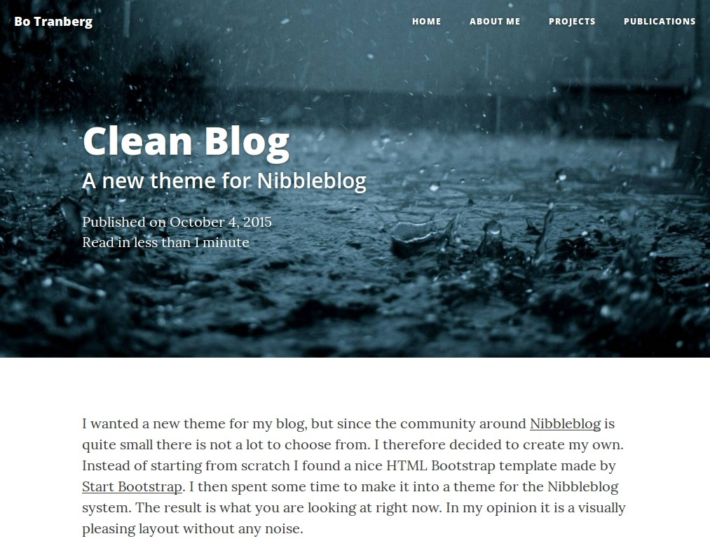

Clean Blog
==========

**Clean Blog** is a minimalist Bootstrap theme originally made by [Start Bootstrap](http://startbootstrap.com/template-overviews/clean-blog/), which has now been adapted for [Nibbleblog](https://github.com/dignajar/nibbleblog).

So far the only supported Nibbleblog plugin is Pages. There is no support for comments, tags, and categories.

Have a look at the [original license](https://github.com/IronSummitMedia/startbootstrap-clean-blog/blob/gh-pages/LICENSE).

Features
--------
- A post's description is shown as a sub-heading
- To make an image responsive add this to its source in the editor: class="img-responsive"

Install
-------
1. Download zip and unpack
2. Edit default header images in /clean-blog/img/
3. Upload files to /themes/clean-blog/ in your Nibbleblog installation

Screenshot
----------

